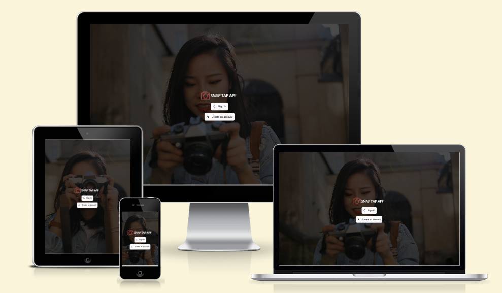
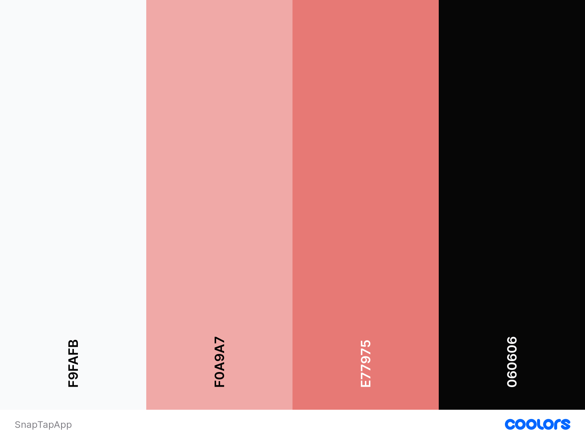
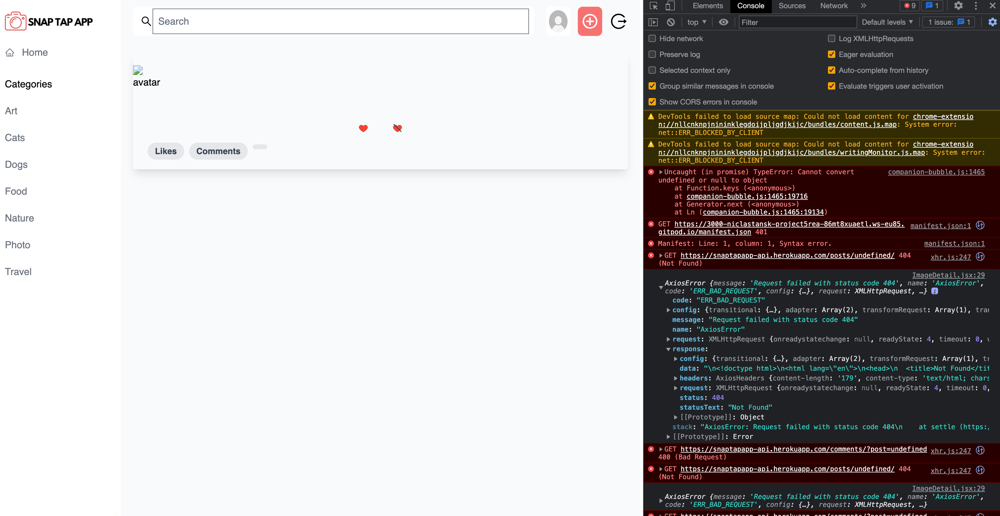
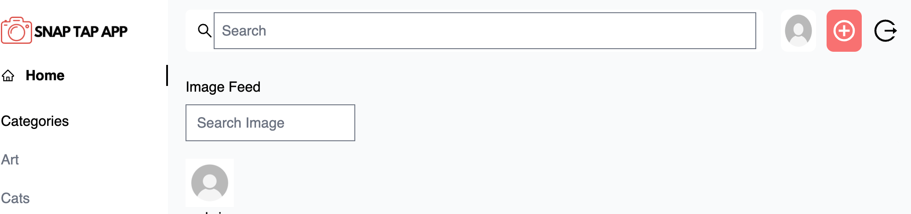
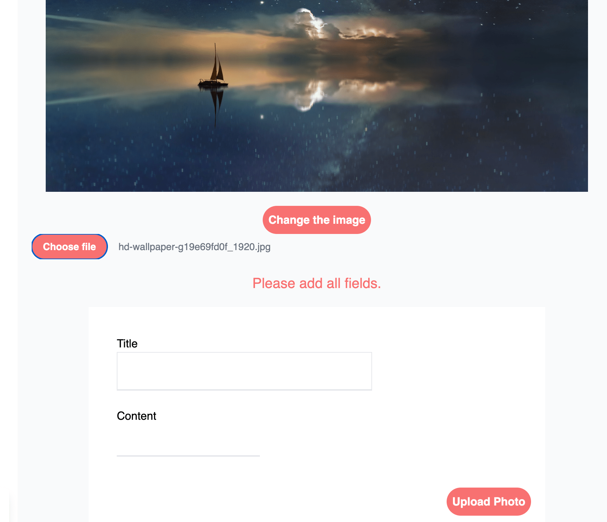
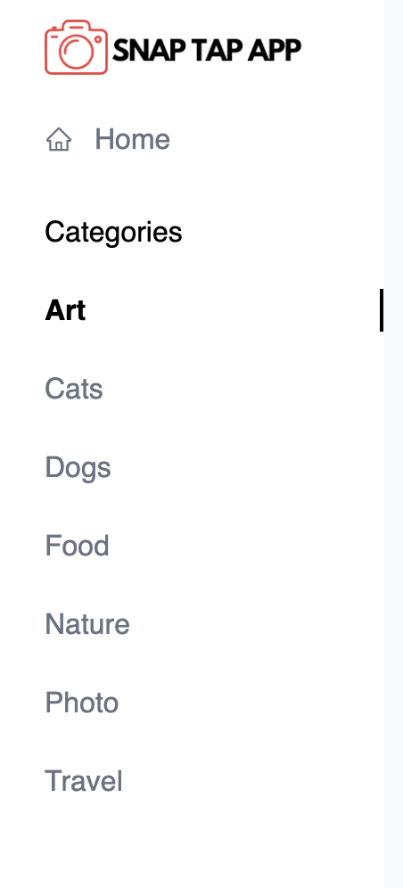
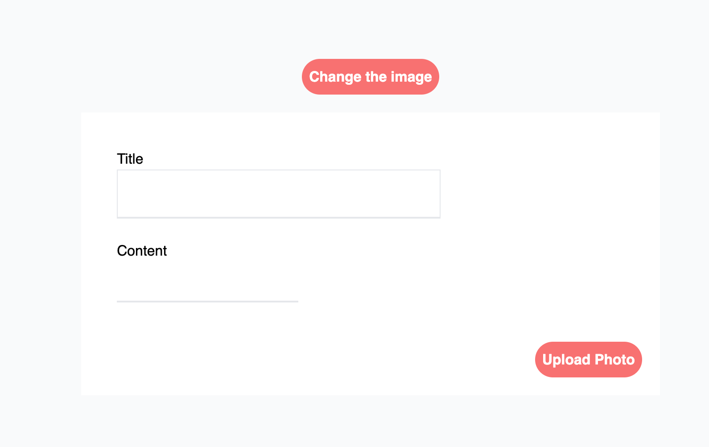
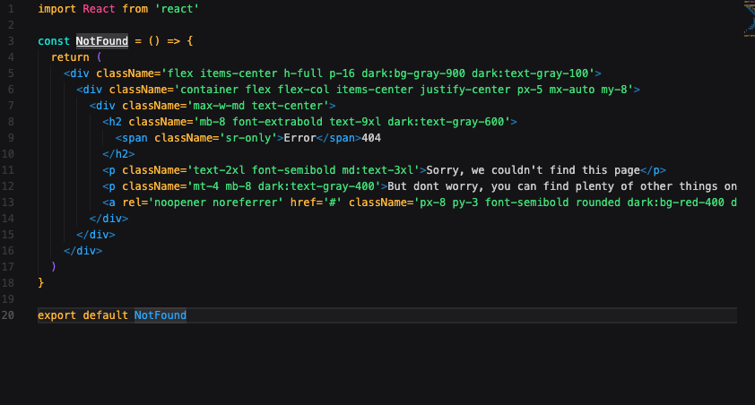

# Snap Tap App




## Demo

[Frontend - Deployment](https://snaptapapp.herokuapp.com/)

### API Project Links

- [API - Repository](https://github.com/niclastanskanen/project-5-api)
- [API - Deployment](https://snaptapapp-api.herokuapp.com/)

<hr>

## Table of Contents

- [User Experience (UX)](#user-experience-ux)
  - [User Stories](#user-stories)
  - [Agile Methodology](#agile-methodology)
  - [Design](#design)
    - [Wireframes](#wireframes)
    - [Color Scheme](#color-scheme)
    - [Typography](#typography)
    - [Images and Iconography](#images-and-iconography)
- [Features](#features)
  - [Home Page](#home-page)
  - [Navigation](#navigation)
  - [Register (Sign up) / Login](#register-sign-up--login)
  - [Profile](#profile)
  - [Profile Edit Form](#profile-edit-form)
  - [Username and Password Edit Forms](#username-and-password-edit-forms)
  - [Components](#components)
- [Testing](#testing)
  - [Bugs](#bugs)
    - [Fixed Bugs](#fixed-bugs)
    - [Remaining Bugs](#remaining-bugs)
- [Technologies Used](#technologies-used)
  - [Languages and Frameworks Used](#languages-and-frameworks-used)
  - [Node Packages / Dependencies Used](#node-packages--dependencies-used)
  - [Programs and Tools Used](#programs-and-tools-used)
- [Deployment](#deployment)
  - [Forking the GitHub Repository](#forking-the-github-repository)
  - [Making a Local Clone](#making-a-local-clone)
  - [Deploying with Heroku](#deploying-with-heroku)
  - [Linking with the API/backend](#linking-with-the-apibackend)
- [Credits](#credits)
  - [Code](#code)
  - [Media](#media)
  - [Acknowledgments](#acknowledgments)

<hr>

## User Stories

- As a user I can view the navbar from every page so that I can easily go by different pages - *Must Have* 
- User Stories - As a user I can filter photos so that I can find what I want to see faster - *Should Have*
- User Stories - As a user I can search for photos and categories so that I can find photos - *Must Have*
- User Stories - As a user I can choose to signup so that I can use all features - *Must Have*
- User Stories - As a user I can leave a comment on a picture so that I can give support to the creator - *Must Have*
- User Stories - As a user I can like a picture so that I can give support to the creator - *Must Have*
- User Stories - As a user I can maintain logged in until I choose to log out so that I don’t have to log in all-time - *Must Have*
- User Stories - As a user I can see other user’s profiles so that I can get information about them - *Should have*
- User Stories - As a user I can see other user's profiles so that I can see their uploaded photos - *Should have*
- User Stories - As a logged in user I can upload pictures so that I can share my photos with the community - *Must have*
- User Stories - As a user I can view details of photos so that I can learn more about it - *Must Have*
- User Stories - As a user I can view all the photos without going to next page so that I can scroll forever - *Must Have*
- User Stories - As a user I can see date and time for a photo so I can see how old the photo is - *Could Have*
- User Stories - As a user I can edit my comments so I can fix typos - *Must Have*
- User Stories - As a user I can delete my comments so I can change my mind and don’t want to comment on a photo - *Must Have*
- User Stories - As a user I can read other people's comments so that I can read what other people think - *Must have*
- User Stories - As a user I can see statistics about a specific user: Followers and following so I can find other people to look at - *Should Have*
- User Stories - As a user I can follow and unfollow other people so that I can choose which photos I want to see - *Should Have*
- User Stories - As a user I can edit my photos title and description so - that I can fix typos or update details - *Should have*
- User Stories - As a user I can delete my photos so that I can choose which photo I want to share - *Must have*
- User Stories - As a user I can login with my google account so that I don’t have to remember my username - *Could have*
- User Stories - As a user I can signup with my google account so that I don’t need type in my account info - *Could Have*
- User Stories - As a user I can save photos to my profile so that I can find them faster - *Should Have*
- User Stories - As a user I can see all my uploaded photos so that I can trace back and see what I have upload - *Should Have*
- User Stories - As a user I can login so that I can access my account - *Must Have*
- User Stories - as a User I can sign out so I can’t access my account - *Must Have*

<hr>

## Agile Methodology

MoSCoW priority was applied to all user stories.

GitHub Kanban was used to track user stories

<hr>

## Design


### Wireframes

### Color scheme


### Typography

### Images and iconography

<hr>

## Features

### Home Page

### Navigation

### Register Sign up Login

### Profile

### Profile Edit Form

### Username and Password Edit Form

### Components

<hr>

## Testing

### Bugs

### Fixed Bugs

### Remaining Bugs










<hr>

## Technologies Used

### Languages and Frameworks Used

### Node Packages / Dependencies Used

### Programs and Tools Used

<hr>

## Deployment

### Forking the GitHub Repository

By forking the GitHub Repository we make a copy of the original repository on
our GitHub account to view and/or make changes without affecting the original
repository by using the following steps...

1. Log in to GitHub and locate the [GitHub
   Repository](https://github.com/niclastanskanen/project-5-api)
1. At the top of the Repository (not top of page) just above the "Settings"
   Button on the menu, locate the "Fork" Button.
1. Click the button (not the number to the right) and you should now have a copy
   of the original repository in your GitHub account.

### Making a Local Clone

**NOTE**: It is a requirement of the project that you have Python version 3.8 or higher installed locally.

1. Log in to GitHub and locate the [GitHub Repository](https://github.com/niclastanskanen/project-5-api).
1. Under the repository name, click "Code".
1. To clone the repository using HTTPS, under "HTTPS", copy the link.
1. Open your local terminal with git installed
1. Change the current working directory to the location where you want the cloned directory to be created.
1. Type `git clone`, and then paste the URL you copied in Step 3.

    ```console
    ~$ git clone https://github.com/niclastanskanen/project-5-api
    ```

1. Press Enter. Your local clone will be created.

    ```console
    $ git clone https://github.com/niclastanskanen/project-5-api
    > Cloning into `test-dir`...
    > remote: Counting objects: 10, done.
    > remote: Compressing objects: 100% (8/8), done.
    > remove: Total 10 (delta 1), reused 10 (delta 1)
    > Unpacking objects: 100% (10/10), done.
    ```

    [Click here](https://help.github.com/en/github/creating-cloning-and-archiving-repositories/cloning-a-repository#cloning-a-repository-to-github-desktop) for a more detailed explanation of the process above with pictures.

1. Change the current working directory to the cloned project folder (this will be a child directory in the location you cloned the project).

1. This guide assumes you have Node.js and npm installed locally, if this is not the case please install these now.
1. From the terminal run the command `npm install` to install all project dependencies.
1. Run the command `npm start` to run the application.

### Deploying with Heroku

**NOTE**: It is a prerequisite of deployment to Heroku that you already have access to the following:

**NOTE**: It is assumed you have followed all deployment instructions listed in this readme starting with the section titled 'Forking the GitHub Repository'.

1. Log in to [Heroku](https://www.heroku.com/) and if not taken there automatically, navigate to your personal app dashboard.
2. At the top of the page locate the 'New' drop down, click it and then select 'Create new app'.
3. Give your application a unique name, select a region appropriate to your location and click the 'Create app' button.
4. Your app should now be created. From the menu towards the top of the page select the 'Settings' section and click 'Reveal Config Vars' in the Config vars section.
5. Navigate to the 'Deploy' page using the menu towards the top of the page.
6. Select 'GitHub' from the 'Deployment method' section and you will be prompted to 'Connect to GitHub'.
7. Once connected to your GitHub account you will be able to search for your repository which contains the forked 'SnapTapApp' repository.
8. Once the repository is found click 'Connect'.
9. At the bottom of the page find the section named 'Manual deploy', select the 'main' branch in the drop down and click the 'Deploy' button.
10. Once deployment is complete, click the 'View' button to load the URL of the deployed application.

### Linking with the API/backend

You will need to ensure you have set the `axios.defaults.baseURL` in the `api/axiosDefaults.jsx` file to the url of your deployed version of th API.
You should then update the `CLIENT_ORIGIN` config variable in your deployed version of the API to ensure you will be able to make authenticated requests to this API.

<hr>

## Credits

### Code

### Media

### Acknowledgments


