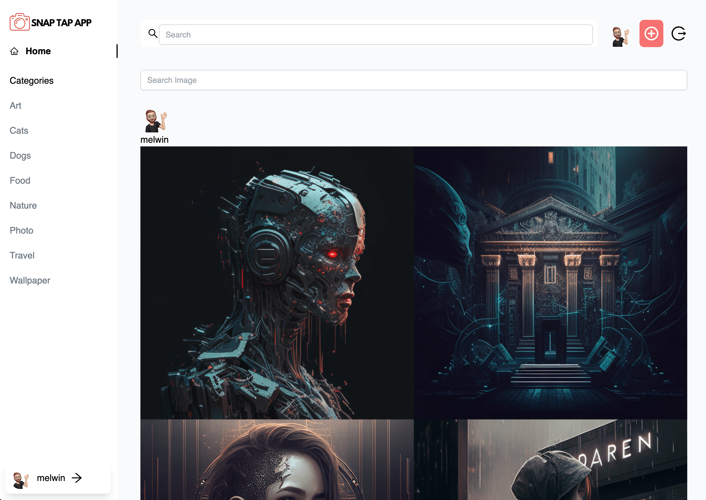
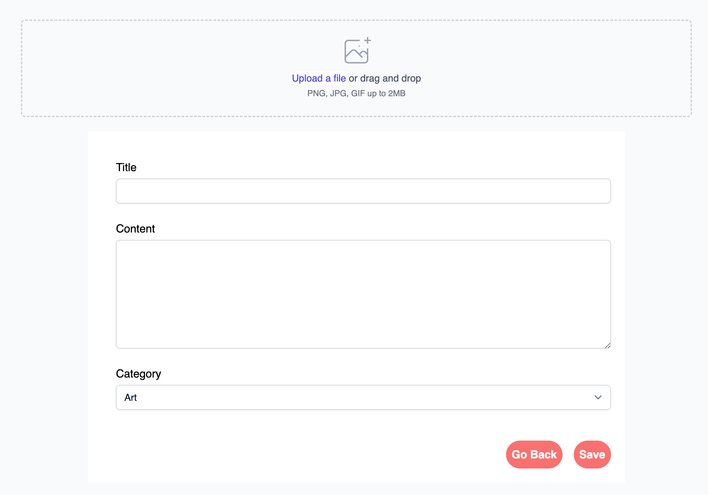
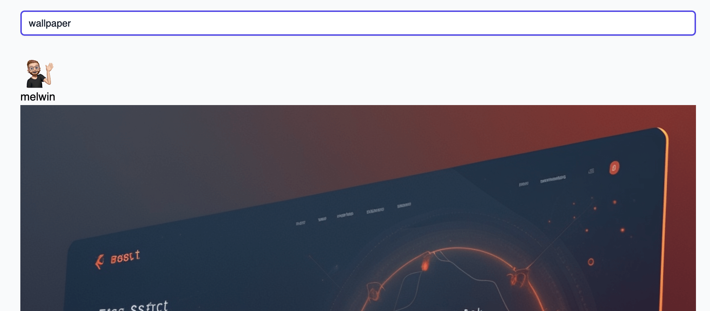

# Snap Tap App :desktop_computer:

Snaptapapp is a closed app for photo enthusiasts who wish to share their daily lives with their friends and family. An easy-to-navigate, fast, and easy-to-use website that makes it easy to find what you are looking for.

## The Live link can be found here -> [Snap Tap App](https://snaptapapp.herokuapp.com/)


### API Project Links

- [API - Repository](https://github.com/niclastanskanen/project-5-api)
- [API - Deployment](https://snaptapapp-api.herokuapp.com/)

<hr>

## Table of Contents

- [User Experience (UX)](#user-experience-ux)
  - [User Stories](#user-stories)
  - [Agile Methodology](#agile-methodology)
  - [Design](#design)
    - [Wireframes](#wireframes)
    - [Color Scheme](#color-scheme)
    - [Typography](#typography)
- [Features](#features)
  - [Home Page](#home-page)
  - [Navigation](#navigation)
  - [Register (Sign up) / Login](#register-sign-up--login)
  - [Profile](#profile)
  - [Profile Edit Form](#profile-edit-form)
  - [Username and Password Edit Forms](#username-and-password-edit-forms)
  - [Upload Images](#Upload-Images)
  - [Feed / Search](#Feed-/-Search)
  - [Components](#Components)
    - [Components used in this application](#Components-used-in-this-application)
- [Testing](#testing)
  - [User Story Testing](#user-story-testing)
  - [Bugs](#bugs)
    - [Fixed Bugs](#fixed-bugs)
    - [Remaining Bugs](#remaining-bugs)
- [Technologies Used](#technologies-used)
  - [Languages and Frameworks Used](#languages-and-frameworks-used)
  - [Node Packages / Dependencies Used](#node-packages--dependencies-used)
  - [Programs and Tools Used](#programs-and-tools-used)
- [Deployment](#deployment)
  - [Forking the GitHub Repository](#forking-the-github-repository)
  - [Making a Local Clone](#making-a-local-clone)
  - [Deploying with Heroku](#deploying-with-heroku)
  - [Linking with the API/backend](#linking-with-the-apibackend)
- [Credits](#credits)
  - [Acknowledgments](#acknowledgments)

<hr>

## User Stories

- As a user I can view the navbar from every page so that I can easily go by different pages - *Must Have* 
- User Stories - As a user I can filter photos so that I can find what I want to see faster - *Should Have*
- User Stories - As a user I can search for photos and categories so that I can find photos - *Must Have*
- User Stories - As a user I can choose to signup so that I can use all features - *Must Have*
- User Stories - As a user I can leave a comment on a picture so that I can give support to the creator - *Must Have*
- User Stories - As a user I can like a picture so that I can give support to the creator - *Must Have*
- User Stories - As a user I can maintain logged in until I choose to log out so that I don’t have to log in all-time - *Must Have*
- User Stories - As a user I can see other user’s profiles so that I can get information about them - *Should have*
- User Stories - As a user I can see other user's profiles so that I can see their uploaded photos - *Should have*
- User Stories - As a logged in user I can upload pictures so that I can share my photos with the community - *Must have*
- User Stories - As a user I can view details of photos so that I can learn more about it - *Must Have*
- User Stories - As a user I can view all the photos without going to next page so that I can scroll forever - *Must Have*
- User Stories - As a user I can see date and time for a photo so I can see how old the photo is - *Could Have*
- User Stories - As a user I can edit my comments so I can fix typos - *Must Have*
- User Stories - As a user I can delete my comments so I can change my mind and don’t want to comment on a photo - *Must Have*
- User Stories - As a user I can read other people's comments so that I can read what other people think - *Must have*
- User Stories - As a user I can see statistics about a specific user: Followers and following so I can find other people to look at - *Should Have*
- User Stories - As a user I can follow and unfollow other people so that I can choose which photos I want to see - *Should Have*
- User Stories - As a user I can edit my photos title and description so - that I can fix typos or update details - *Should have*
- User Stories - As a user I can delete my photos so that I can choose which photo I want to share - *Must have*
- User Stories - As a user I can login with my google account so that I don’t have to remember my username - *Could have*
- User Stories - As a user I can signup with my google account so that I don’t need type in my account info - *Could Have*
- User Stories - As a user I can save photos to my profile so that I can find them faster - *Should Have*
- User Stories - As a user I can see all my uploaded photos so that I can trace back and see what I have upload - *Should Have*
- User Stories - As a user I can login so that I can access my account - *Must Have*
- User Stories - as a User I can sign out so I can’t access my account - *Must Have*

<hr>

## Agile Methodology

MoSCoW priority was applied to all user stories.

<details><summary>User Stories</summary>


</details>
<br>
GitHub Kanban was used to track user stories
<details><summary>Kanban</summary>


</details>
<hr>

## Design


### Wireframes
<details><summary>Click to open</summary>


</details>
<br>

### Color scheme
<details><summary>Click to open</summary>


</details>
<br>

### Typography

Google fonts Lato and sans-serif as back up -> https://fonts.google.com/specimen/Lato?query=Lato


<hr>

## Features

### Home Page

### Navigation

### Register Sign up Login


### Profile

### Profile Edit Form

### Username and Password Edit Form

### Upload Images


### Feed / Search


### Edit Image


## Components

Components in ReactJS allow developers to break user interfaces into elements that can be reused across a variety of applications by providing independent and reusable blocks of code. Managing a large code base this way reduces code duplication and complexity (update the component once instead of each page).

It is also possible to update individual components independently, so that errors in one component can be addressed independently of those in other components, preventing the entire page from failing to load as a result.

The following components were developed during the development of this project. All components offer the following benefits:

- Code can be consolidated into a single re-usable component that can be used in multiple parts of the application and debugged in a single location.

- Provided a consistent user experience across pages without having to duplicate code or manage duplicate code.

### Components used in this application

- Avatar
  - Used to display the user avatar in different variations throughout the site (based on use and viewport size).
  - UX experience is improved as users can quickly identify the author of image.

- Dropdown
  - Used on profile's upload image to fast edit or delete photos.
  - The UX was improved by presenting consistent icons across the site

- Navbar
  - Every page has a navigation bar that provides access to search, profile view, add photo, and signout, which improves the user experience.

- Search
  - Search is used in the Navbar to increase accessibility for the user to be able to search wherever they are on the application

- Not Found
  - This component is displayed when a user navigates to a resource that doesn't exist.
  - It improves the user experience by providing feedback when an error has occurred and allowing the NavBar to remain accessible so they can continue to use the site.

- MasonryLayout
  - Masonry layout is a layout method where one axis uses a typical strict grid layout, most often columns, and the other a masonry layout. On the masonry axis, rather than sticking to a strict grid with gaps being left after shorter items, the items in the following row rise up to completely fill the gaps.

- Spinner
  - The react-loader-spinner that provides a simple and attractive SVG spinner component that is been used on all pages when data is loading.
  - Spinner component provides a way to show the loading effect increase the user experience

<hr>

## Testing

### User Story Testing

These tests were carried out when a feature was completed and committed during development. They have also been carried out against the deployed version of the site, the results of which are displayed below.

In addition to the test detailed below, all site URL's were tested to ensure they took users to the correct page.

### Navigation

#### User Story [#1](https://github.com/niclastanskanen/project-5-react/issues/1)

As a user I can view the navbar from every page so that I can easily go by different pages.

| Test # | Test | Outcome | Result |
|---|---|---|---|
| 1 | The navigation bar should be visible on every page and inform users of their current location in the site structure. | NavBar is displayed at the top of every page. | :white_check_mark: |
| 2 | The navigation bar should present a different layout suited to the screen size it is being viewed from. | NavBar is responsive on different viewport. | :white_check_mark: |
| 3 | All links are accurate and take users to the expected resource. | No broken links and all link to the expected URL. | :x: |


### Authentication

#### User Story [#4](https://github.com/niclastanskanen/project-5-react/issues/4)

User Stories - As a user I can choose to signup so that I can use all features.

| Test # | Test | Outcome | Result |
|---|---|---|---|
| 1 | Users can register with a unique username and a password. | Confirmed username must be unique | :white_check_mark: |
| 3 | Confirm user account has been created by the API upon successful form submission. | User account confirmed created in the database. | :white_check_mark: |

#### User Story [#25](https://github.com/niclastanskanen/project-5-react/issues/25)

User Stories - As a user I can login so that I can access my account .

| Test # | Test | Outcome | Result |
|---|---|---|---|
| 1 | Users can sign in using the credentials they used to sign up. | Using correct credentials results in the successful login. | :white_check_mark: |
| 2 | Login errors are reported to the user. | If an incorrect username or password is entered this is reported to the user on the login form. | :white_check_mark: |

#### User Story [#26](https://github.com/niclastanskanen/project-5-react/issues/26)

User Stories - as a User I can sign out so I cant access my account.

| Test # | Test | Outcome | Result |
|---|---|---|---|
| 1 | Users can log out and end their session using a link on the navigation bar. | Logout link sends logout request to API as expected. | :white_check_mark: |
| 2 | Local storage is cleared of JWT token expiry information. | Local storage is successfully cleared. | :white_check_mark: |

#### User Story [#7](https://github.com/niclastanskanen/project-5-react/issues/7)

User Stories - As a user I can maintain logged in until I choose to log out so that I don’t have to log in all-time.

| Test # | Test | Outcome | Result |
|---|---|---|---|
| 1 | Logged in and waited 10 minutes (to ensure user token has expired) | Restricted page loads as expected. | :x: |

#### User Story [#10](https://github.com/niclastanskanen/project-5-react/issues/10)

User Stories - As a logged in user I can upload pictures so that I can share my photos with the community.

| Test # | Test | Outcome | Result |
|---|---|---|---|
| 1 | Images must be less that 2MB in size. | Attempted to submit form with images over 2MB and received validation error. | :x: |
| 2 | Images must have a height and width less than 4096px. | Attempted to submit form with an image height and width in excess of the limit (4096px) and received validation error. | :x: |
| 3 | Successful form submission results in a record being created by the API. | Image upload in the database. | :white_check_mark: |

#### User Story [#2](https://github.com/niclastanskanen/project-5-react/issues/2)

User Stories - As a user I can filter photos so that I can find what I want to see faster.

| Test # | Test | Outcome | Result |
|---|---|---|---|
| 1 | Home page displays all image in a single page view. | All images displayed as expected, ordered by creation. | :white_check_mark: |
| 2 | Can search for images both on user and title. | All images displayed as expected, ordered by creation. | :white_check_mark: |

#### User Story [#3](https://github.com/niclastanskanen/project-5-react/issues/3)

User Stories - As a user I can search for photos and categories so that I can find photos

| Test # | Test | Outcome | Result |
|---|---|---|---|
| 1 | Can search for images both on user and title. | All images displayed as expected, ordered by creation. | :white_check_mark: |

#### User Story [#9](https://github.com/niclastanskanen/project-5-react/issues/9)

User Stories - As a user I can see other user's profiles so that I can see their uploaded photos.

| Test # | Test | Outcome | Result |
|---|---|---|---|
| 1 | Clicking on a images, will load the users profile page. | Profile detail page loads as expected. | :white_check_mark: |
| 2 | Profile detail page displays information. | All information display correct and statistic loads with the correct data. | :white_check_mark: |

#### User Story [#19](https://github.com/niclastanskanen/project-5-react/issues/19)

User Stories - As a user I can edit my photos title and description so that I can fix typos or update details.

| Test # | Test | Outcome | Result |
|---|---|---|---|
| 1 | A image can be edited. | When logged in as the owner the edit/delete component is visible and the edit form loads when selected. | :white_check_mark: |
| 2 | Image will be displayed in an editable format with existing information populated. | All current information is populated. | :x: |
| 3 | When saved, the information in the image will be updated to reflect any changes made. | Information that has been changed (images, form field information) is updated in the detail view when the form is submitted and is updated in the database by the API | :x: |


#### User Story [#20](https://github.com/niclastanskanen/project-5-react/issues/20)

User Stories - As a user I can delete my photos so that I can choose which photo I want to share.

| Test # | Test | Outcome | Result |
|---|---|---|---|
| 1 | A image can be deleted using trashcan icon within the individual image view. | When logged in as the owner the more actions component is visible, the image is deleted from the database by the API, and the user is redirected to the previous page when the menu action is selected. | :white_check_mark: |

#### User Story [#6](https://github.com/niclastanskanen/project-5-react/issues/6)

User Stories - As a user I can like a picture so that I can give support to the creator

| Test # | Test | Outcome | Result |
|---|---|---|---|
| 1 | A like icon will update when clicked by an authenticated user to show that the image is liked. | When clicked by an authenticated user the like count goes up by 1 or down by 1 if clicked on unlike and the record is created in the database by the API. | :white_check_mark: |


#### User Story [#20](https://github.com/niclastanskanen/project-5-react/issues/20)

User Stories - As a user I can delete my photos so that I can choose which photo I want to share.

| Test # | Test | Outcome | Result |
|---|---|---|---|
| 1 | A trash icon will remove when clicked by an authenticated user. | When clicked by an authenticated user the image get deleted and removed and the image is deleted from the database by the API. | :white_check_mark: |

#### User Story [#11](https://github.com/niclastanskanen/project-5-react/issues/11)

User Stories - As a user I can view details of photos so that I can learn more about it.

| Test # | Test | Outcome | Result |
|---|---|---|---|
| 1 | Click and visit the image page | Visiting the image detail page displays image, title, content. | :x: |
| 2 | Click and visit the image page | Can see likes and comments | :x: |

#### User Story [#12](https://github.com/niclastanskanen/project-5-react/issues/12)

User Stories - As a user I can view all the photos without going to next page so that I can scroll forever.

| Test # | Test | Outcome | Result |
|---|---|---|---|
| 1 | Navigate to home to Image feed to see all photos load. | Infinite scroll working and loader loads when loading more image.  | :white_check_mark: |


#### User Story [#13](https://github.com/niclastanskanen/project-5-react/issues/13)

User Stories - As a user I can see date and time for a photo so I can see how old the photo is.

| Test # | Test | Outcome | Result |
|---|---|---|---|
| 1 | Navigate to image feed and profile to see when image is added | Date shows under all photos | :white_check_mark: |


#### User Story [#17](https://github.com/niclastanskanen/project-5-react/issues/17)

User Stories - As a user I can see statistics about a specific user: Followers and following so I can find other people to look at.

| Test # | Test | Outcome | Result |
|---|---|---|---|
| 1 | Navigate to profile info | Under profile picture static shows with correct data | :white_check_mark: |

#### User Story [#18](https://github.com/niclastanskanen/project-5-react/issues/18)

User Stories - As a user I can follow and unfollow other people so that I can choose which photos I want to see.

| Test # | Test | Outcome | Result |
|---|---|---|---|
| 1 | Go in to specific profile to see follow/unfollow button. | After pressing follow, user owners profile static should update and profile that was followed. | :x: |

#### User Story [#24](https://github.com/niclastanskanen/project-5-react/issues/24)

User Stories - As a user I can see all my uploaded photos so that I can trace back and see what I have upload.

| Test # | Test | Outcome | Result |
|---|---|---|---|
| 1 | Navigate to owner profile and see if uploaded image showing  | Image loading sort by uploaded date | :white_check_mark: |


## Code Validation

### JSX

Warning:


### CSS

The W3C CSS Validator Service was used to validate the project's custom CSS files to ensure there were no syntax errors.

| File | Result |
|---|---|
|  | :white_check_mark: |


### Lighthouse Scores

The site scored well for both desktop and mobile. Performance different a lot using live site vs incognito vs normal vs dev deployment.

- Main Page Desktop


- Main Page Mobile


### Devices used for manual testing

Site was tested using the following desktop and mobile browsers:

- Chrome (v.103), Firefox (v.103), Firefox Developer Edition (v.104), Safari (iOS 16 on Iphone 14 ProMax, iPhone 7 and iPad 6th Gen).

### Bugs

### Fixed Bugs

### Remaining Bugs

### Image detail don't render correct


### My main search in top dosn't work with search function but when I put in another one outside navbar then its working.


### Choose file dosn't hid when preview image to upload.


### Sidebar profile name, don't render, its working with profile ID?


### Sidebar categories, don't render and I took that away and using placeholder instead.


### Edit image/post dosn't render previews info.


### When you are not loggedin, you should not have access to homepage. When if currentuser are used, it got stack in "login loop" and it broke. 


### Page 404 don't render or render all time.


### jwttooken didn't worked in dev but seems to be working on live site.


<hr>

## Technologies Used

### Languages and Frameworks Used
- HTML
- JavaScript
- React

### Node Packages / Dependencies Used

- [TailwindCSS](https://tailwindcss.com/)
- [React Icons](https://react-icons.github.io/react-icons)
- [React Loader Spinner](https://www.npmjs.com/package/react-loader-spinner)
- [React Masonry CSS](https://www.npmjs.com/package/react-masonry-css)
- [React Infinite Scroll](https://www.npmjs.com/package/react-infinite-scroll-component)
- [Axios](https://www.npmjs.com/package/axios)
- [jwt decoode](https://www.npmjs.com/package/jwt-decode)

### Programs and Tools Used
- [Git](https://git-scm.com/)
- [GitHub](https://github.com/)
- [GitPod](https://www.gitpod.io/)

<hr>

## Deployment

### Forking the GitHub Repository

By forking the GitHub Repository we make a copy of the original repository on
our GitHub account to view and/or make changes without affecting the original
repository by using the following steps...

1. Log in to GitHub and locate the [GitHub
   Repository](https://github.com/niclastanskanen/project-5-api)
1. At the top of the Repository (not top of page) just above the "Settings"
   Button on the menu, locate the "Fork" Button.
1. Click the button (not the number to the right) and you should now have a copy
   of the original repository in your GitHub account.

### Making a Local Clone

**NOTE**: It is a requirement of the project that you have Python version 3.8 or higher installed locally.

1. Log in to GitHub and locate the [GitHub Repository](https://github.com/niclastanskanen/project-5-api).
1. Under the repository name, click "Code".
1. To clone the repository using HTTPS, under "HTTPS", copy the link.
1. Open your local terminal with git installed
1. Change the current working directory to the location where you want the cloned directory to be created.
1. Type `git clone`, and then paste the URL you copied in Step 3.

    ```console
    ~$ git clone https://github.com/niclastanskanen/project-5-api
    ```

1. Press Enter. Your local clone will be created.

    ```console
    $ git clone https://github.com/niclastanskanen/project-5-api
    > Cloning into `test-dir`...
    > remote: Counting objects: 10, done.
    > remote: Compressing objects: 100% (8/8), done.
    > remove: Total 10 (delta 1), reused 10 (delta 1)
    > Unpacking objects: 100% (10/10), done.
    ```

    [Click here](https://help.github.com/en/github/creating-cloning-and-archiving-repositories/cloning-a-repository#cloning-a-repository-to-github-desktop) for a more detailed explanation of the process above with pictures.

1. Change the current working directory to the cloned project folder (this will be a child directory in the location you cloned the project).

1. This guide assumes you have Node.js and npm installed locally, if this is not the case please install these now.
1. From the terminal run the command `npm install` to install all project dependencies.
1. Run the command `npm start` to run the application.

### Deploying with Heroku

**NOTE**: It is a prerequisite of deployment to Heroku that you already have access to the following:

**NOTE**: It is assumed you have followed all deployment instructions listed in this readme starting with the section titled 'Forking the GitHub Repository'.

1. Log in to [Heroku](https://www.heroku.com/) and if not taken there automatically, navigate to your personal app dashboard.
2. At the top of the page locate the 'New' drop down, click it and then select 'Create new app'.
3. Give your application a unique name, select a region appropriate to your location and click the 'Create app' button.
4. Your app should now be created. From the menu towards the top of the page select the 'Settings' section and click 'Reveal Config Vars' in the Config vars section.
5. Navigate to the 'Deploy' page using the menu towards the top of the page.
6. Select 'GitHub' from the 'Deployment method' section and you will be prompted to 'Connect to GitHub'.
7. Once connected to your GitHub account you will be able to search for your repository which contains the forked 'SnapTapApp' repository.
8. Once the repository is found click 'Connect'.
9. At the bottom of the page find the section named 'Manual deploy', select the 'main' branch in the drop down and click the 'Deploy' button.
10. Once deployment is complete, click the 'View' button to load the URL of the deployed application.

### Linking with the API/backend

You will need to ensure you have set the `axios.defaults.baseURL` in the `api/axiosDefaults.jsx` file to the url of your deployed version of th API.
You should then update the `CLIENT_ORIGIN` config variable in your deployed version of the API to ensure you will be able to make authenticated requests to this API.

<hr>

## Credits

### Images & Icons
- [Canva](https://www.canva.com/)
- [Video Videvo](https://www.videvo.net/video/close-up-of-the-beautiful-young-woman-taking-a-picture-with-a-photocamera-and-then-smiling-in-the-historical-town-in-sunlight-1/1117971/)
- [User background photo](https://wallpaperscraft.com/all/1600x900)

### Tools
- [Am I Responsive](http://ami.responsivedesign.is/)
- [Google Fonts](https://fonts.google.com/)
- [Color Scheme](https://coolors.co/)
- [Image Compressor](https://business-tools.clickfunnels.com/business-tools/compress-image)
- [Video Compressor](https://www.freeconvert.com/video-compressor/download)

### Coding Guide
- [JSX React](https://reactjs.org/docs/introducing-jsx.html)
- [Code Institute Moments](https://github.com/Code-Institute-Solutions/moments/)


### Acknowledgments


